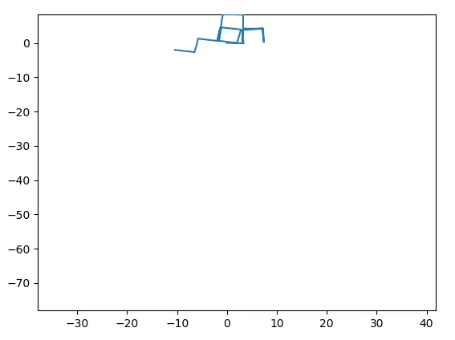
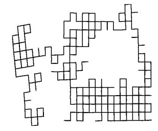
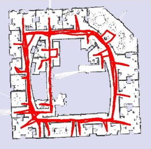

# 2D Pose Graph Optimization
This repository is an implementation of 2D (i.e, 3 degrees of freedom - x,y,theta) pose graph optimization in Python.  
A modified gradient descent as authored by Olson et. al. found in refs is implemented.  
The code has been tested on the Intel and Manhattan dataset's TORO version.  

## Odometry motion for Manhattan data

## Graph optimization for M3500

## Ground truth M3500 data

## Graph optimization for Intel data

## Ground truth Intel data

